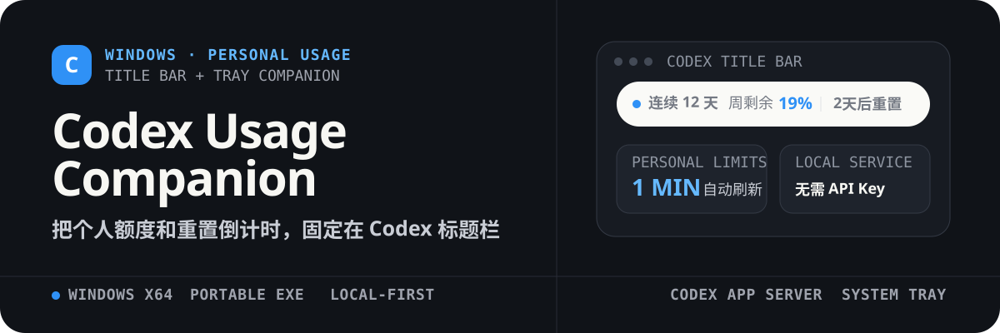
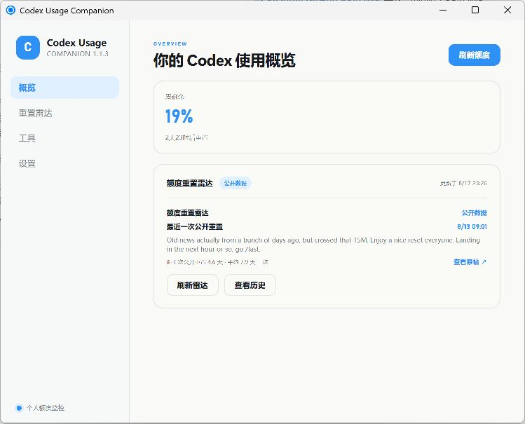

<p align="center">
  
</p>

<p align="center">
  Windows x64 的 Codex 个人额度伴侣。标题栏随时看剩余额度，控制中心查看重置时间、Token 趋势和公开重置记录。
</p>

<p align="center">
  <strong>Portable EXE</strong> · <strong>1 分钟刷新</strong> · <strong>无需 API Key</strong> · <strong>本地优先</strong>
</p>

<p align="center">
  <a href="#它解决什么">功能</a> ·
  <a href="#快速开始">快速开始</a> ·
  <a href="#隐私与边界">隐私与边界</a> ·
  <a href="#开发与打包">开发</a>
</p>

## 先看实际界面

<p align="center">
  
</p>

<p align="center"><sub>控制中心：个人额度概览、公开重置雷达、工具和设置。</sub></p>

## 它解决什么

使用 Codex 时，额度信息不应该藏在需要反复打开的页面里。Codex Usage Companion 把最常用的信息放回你正在工作的地方：

- **标题栏额度胶囊**：Codex 位于前台时，显示连续使用天数、剩余额度和最近重置倒计时。
- **悬停详情**：展开个人额度窗口、重置卡和最近 7 天 Token 趋势，不抢焦点，不阻塞标题栏拖动。
- **控制中心与托盘**：支持立即刷新、开机启动、静默进入托盘和脱敏诊断导出。
- **额度重置雷达**：展示第三方整理的公开重置公告、观察信号和最近 20 条历史记录，与个人额度结果分开呈现。
- **后台自愈**：个人额度每 1 分钟刷新；短暂失败后自动重试，窗口经过锁屏、唤醒或显示器变化后会自动恢复位置与置顶层级。

## 工作方式

```text
Codex 桌面端登录态
        ↓
随软件携带的 Codex App Server
        ↓
本地额度服务（1 分钟刷新 + 失败重试）
        ├── 标题栏额度胶囊
        ├── 悬停详情与 Token 趋势
        └── 控制中心与系统托盘

Codex Resets 公开数据
        ↓
额度重置雷达（第三方信息，不代表官方承诺）
```

个人额度与公开重置信号是两条独立数据链路。雷达不会改变、替代或预测你的个人额度。

## 快速开始

### 1. 准备环境

- Windows x64
- Codex 桌面端已登录 ChatGPT
- 从源码构建时需要 Node.js 22+ 和 pnpm

### 2. 构建 Portable EXE

```powershell
pnpm install
pnpm package:portable
```

成功后会在 `release/` 生成当前版本的 Portable EXE。最终文件内含 Windows x64 Codex Runtime，使用者运行时不需要另行安装 Node.js 或 .NET SDK。

### 3. 开始使用

1. 运行 `Codex-Usage-Companion-1.1.3-portable.exe`。
2. 将 Codex 切到前台。
3. 稍候几秒，标题栏顶部会出现个人额度胶囊；关闭控制中心后，应用仍会驻留系统托盘。

> 当前仓库尚未发布 GitHub Release，公开下载前请先按上述步骤本地构建。

## 隐私与边界

| 项目 | 处理方式 |
| --- | --- |
| 账户认证 | 交给本地 `codex app-server` 处理；应用不读取或保存 OAuth Token |
| API Key | 不需要 DeepSeek、OpenAI 或 X API Key |
| 本地数据 | 只保存普通设置和派生后的个人额度快照 |
| 诊断导出 | 只包含运行状态、个人额度和错误码，不包含账户 ID、会话正文或原始服务端响应 |
| 外部服务 | 没有自建服务器、遥测或云端中继；重置雷达仅读取公开数据 |
| 预测边界 | 不预测全员额度重置，第三方观察不代表 OpenAI 官方承诺 |

## 开发与打包

```powershell
pnpm install
pnpm typecheck
pnpm test
pnpm test:integration
pnpm dev
```

构建发行包：

```powershell
pnpm package:portable
```

打包过程临时使用 `.portable-staging/`，成功后自动清理中间产物。`release/` 是唯一交付目录，且只保留最新的 Portable EXE。

## 声明

Codex Usage Companion 是非官方个人工具，与 OpenAI 或 X 无隶属或背书关系。第三方许可见 [THIRD_PARTY_NOTICES.md](THIRD_PARTY_NOTICES.md)。
